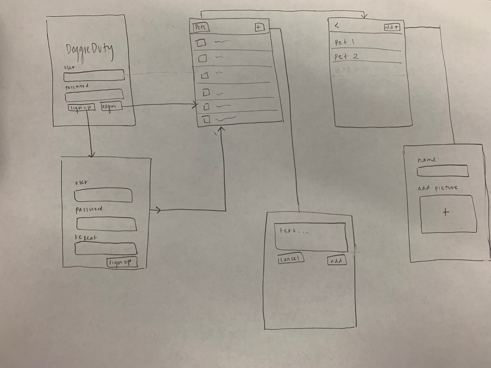

# DoggieDuty

This is an app that helps you see who in your household has taken care of your pet.

## Product Spec

- [x] User can see login and sign up screen
- [x] Parse backend set up
- [x] User can see all view controllers, but not yet functional
- [x] User can stay logged in across restarts 
- [ ] User can view feed of recent pet activity
- [ ] User can post new update to pet activity
- [ ] User can enter pet name and picture for multiple animals 

## WireFrame

## Video Walkthrough

Here's a walkthrough of implemented user stories:

## Schema

User 

| Property | Type | Description |
| --- | --- | --- |
| Username | String | Name of the user | 
| Password | String | User's desired password |

Pet

| Property | Type | Description |
| --- | --- | --- |
| petName | String | Name of user's pets |
| petPic | Picture | Picture of each pet |

Updates

| Property | Type | Description |
| --- | --- | --- |
| updateText | String | Content of user post |

## Networking 

List of network requests by screen: 

* Feed Screen: 
    * (Read/GET) Query all posts from current user 
* Pet Screen: 
    * (Create) Create new pets
* Post Screen: 
    * (Create) Create new pet update 
